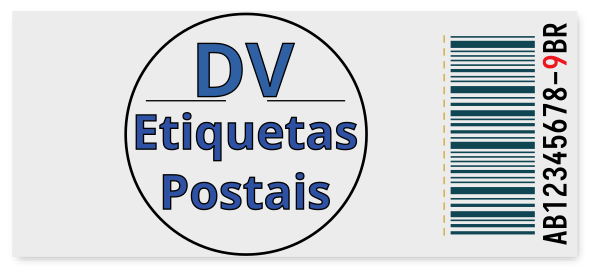
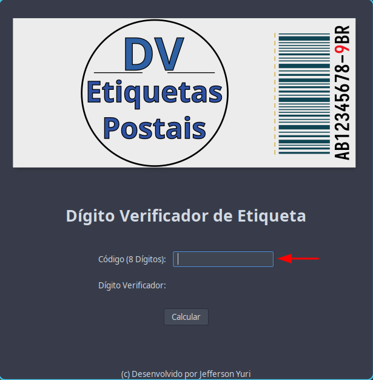
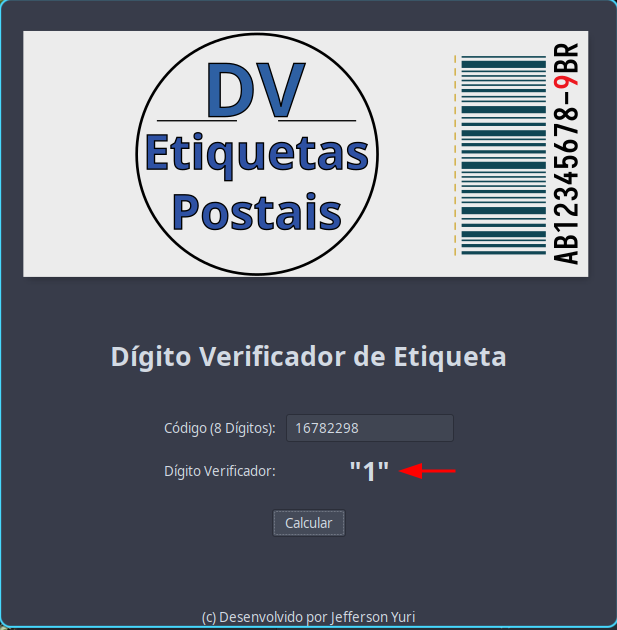

# CalcularDV - Postal Label Check Digit Calculator

A python software to **calculate the digit checker** of postal labels.

I developed this app to use in my company. It is simple, but I took the opportunity to apply the development techniques of a complete project.

## Install

Installation is very easy. Download this project, create a virtual environment and install the dependencies below.

## Dependencies

- PyGObject
- GTK3
  For instructions on how to install these dependencies go to the link: [PyGObject](https://pygobject.readthedocs.io/en/latest/getting_started.html)

## Usage

Run the file **`main.py`**. On the home screen **enter the eight numeric digits** of the postal label.

The international standard for postal labels follows the model:

**AB123456789CD**

The first two letters usually refer to the type of service contracted. These letters should be ignored.

The ninth digit is the check digit. It's obtained through a calculation performed with the first eight digits.

The final two letters usually refer to the country where the package was sent. These two letters are also ignored.

Enter the first **eight digits** in the input field and click calculate.

The **check digit** will appear next.

## Create a .exe for Windows

CalcularDV was initially developed to be used on PCs with OS Windows. Therefore, the project includes configuration files listing the DLLs necessary for its operation. These DLLs were listed to create an executable file for Windows.

If you have interested in creating an .exe or .msi file for use on Windows without having to install python separately, read more about cx_Freeze.

You will need to install the cx_Freeze package in your virtual environment to generate the program installation file. For more information visit the link [cx_Freeze](https://cx-freeze.readthedocs.io/en/latest/).

The **`setup.py`** file has the necessary configuration to build the executable file.

## License

CalcularDV is licensed under the GNU General Puclic License v3.0. See [LICENSE](https://github.com/jeffyuri7/calcularDV/blob/main/LICENSE) for more details.
